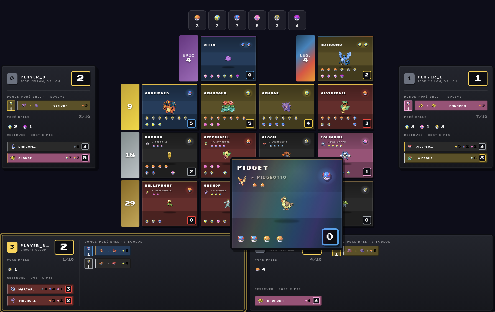
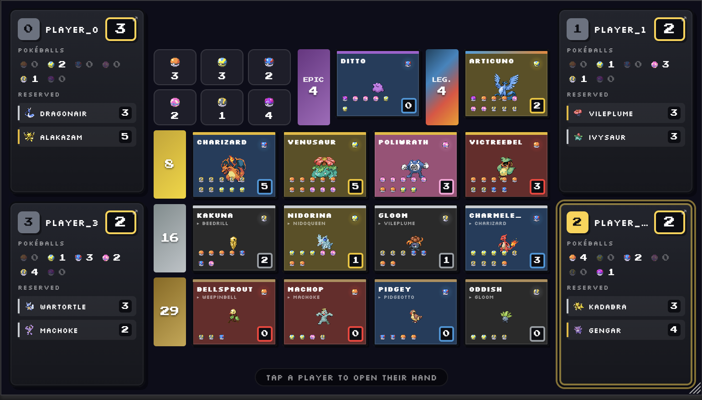
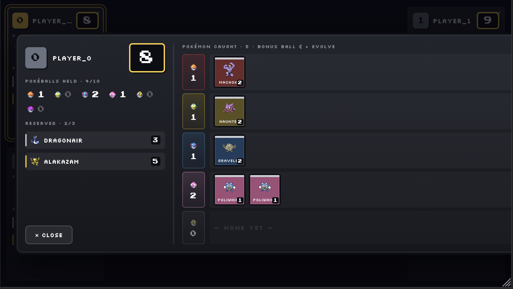

# Pokemon Splendor

Online demo
https://geo-dude.com/splendor

Desktop


Mobile
<p>
  
  
</p>

## Play

```bash
# Two random agents (rendered)
uv run pokemon-splendor

# Human vs rule-based agent
uv run pokemon-splendor --players human,high-point

# Human vs MCTS
uv run pokemon-splendor --players human,mcts --mcts-sims 200 --mcts-depth 4

# Human vs trained RL model
uv run pokemon-splendor --players human,v73p3.zip

# Human vs AlphaZero checkpoint
uv run pokemon-splendor --players human,alpha:alpha_checkpoints/alpha_0100.pt
```

Available agent types: `random`, `human`, `early-capture`, `high-point`, `bonus-engine`,
`evolution-chain`, `denial`, `mcts`, `<model>.zip`, `alpha:<path.pt>`

---

## Benchmark

```bash
# 2-player head-to-head (500 games for statistical confidence)
uv run pokemon-splendor --mode benchmark --games 500 \
    --players v73p3.zip,v7e.zip --workers 12

# 4-player mixed table (most informative for generalisation)
uv run pokemon-splendor --mode benchmark --games 500 \
    --players v73p3.zip,random,denial,early-capture --workers 12

# RL model vs MCTS
uv run pokemon-splendor --mode benchmark --games 100 \
    --players v73p3.zip,mcts --mcts-sims 50 --mcts-depth 2 --workers 8

# Alpha vs MCTS
uv run pokemon-splendor --mode benchmark --games 100 \
    --players alpha:alpha_checkpoints/alpha_0100.pt,mcts \
    --mcts-sims 50 --mcts-depth 2 --workers 8

# Compare two alpha checkpoints
uv run pokemon-splendor --mode benchmark --games 100 \
    --players alpha:alpha_checkpoints/alpha_0010.pt,alpha:alpha_checkpoints/alpha_0100.pt \
    --workers 8
```

Use `--workers` to parallelise across CPU cores. `--games 500` gives a ±4.4% confidence
interval at 95% — enough to distinguish real improvement from noise.

The 4-player mixed benchmark is more informative than 2-player for generalisation: a model
that only wins in 2-player may be exploiting opponent-specific patterns rather than playing
strong general Splendor.

---

## PPO / RL training

### Working curriculum (v7e → v73p3)

```bash
# Fine-tune from strongest existing model against mixed opponents
uv run pokemon-splendor --mode train \
    --opponents denial,v7e.zip --episodes 1000000 \
    --resume v7e.zip --lr 0.00003 --save v73p.zip --workers 8

# Continue from best checkpoint — same opponents, lower lr
uv run pokemon-splendor --mode train \
    --opponents denial,v7e.zip --episodes 1000000 \
    --resume v73p.zip --lr 0.00002 --save v73p3.zip --workers 8
```

**Benchmark results (500 games, 4-player mixed):**

| Model | Win rate | vs MCTS (50 sims) | Notes |
|-------|----------|-------------------|-------|
| v7e   | 33.0%    | —                 | baseline |
| v73p  | 39.4%    | —                 | fine-tune from v7e |
| v73p3 | 43.8%    | —                 | continued fine-tune |
| v73p4 | 47.4%    | —                 | lr=1e-05 |
| v73p5 | 54.4%    | —                 | lr=5e-06 |
| v7-4p | 58.2%    | —                 | 4-player training vs denial,v73p4,v7e |
| v7-4p2 | 60.6%  | —                 | +MCTS opponent (slow) |
| v7-4p3 | 62.8%  | —                 | self-play opponents |
| v7-sp  | 67.0%  | —                 | self-play vs self, lr=1e-06 |
| v7-sp4 | 77.8%  | ~50%              | self-play x4 iterations |
| v7-sp7 | 81.8%  | 57%               | self-play x7 iterations |

v73p5 vs v73p4 in 2-player head-to-head: **58.8%**
v7-4p vs v73p5 in 2-player head-to-head: **57.8%**

**Note on MCTS benchmarks:** MCTS here uses early-capture as its rollout policy, which
is a predictable heuristic with exploitable patterns. A fairer measure of strategic
strength is MCTS using the model itself as rollout — v7-sp4 vs MCTS(v7-sp4 rollout,
50 sims) showed **46%**, meaning explicit search still adds value on top of the learned
policy.

**Self-play curriculum (v7-sp series):**
```bash
uv run pokemon-splendor --mode train \
    --opponents denial,v7-sp7.zip,v7-sp7.zip --episodes 1000000 \
    --resume v7-sp7.zip --lr 0.000001 --save v7-sp8.zip --workers 8
```
Key lessons: use lr=1e-06 (5e-07 is too small — policy freezes), train against the
current best model twice, keep denial for diversity.

### Key training lessons

**Mixed opponents prevent catastrophic forgetting.** Training against a single opponent
(e.g. only `v7e.zip`) causes the model to overfit to that opponent's patterns. Adding
`denial` as a second opponent anchors generalisation and prevents regression.

**Watch `explained_variance` in training output.** Values below 0.3 mean the critic
hasn't converged — more episodes will likely improve the policy further. The v73p3 run
finished at 0.104, leaving significant room for improvement.

**Confirm improvement before continuing.** Always benchmark the new model against the
previous one before committing to the next training run:
```bash
uv run pokemon-splendor --mode benchmark --games 500 \
    --players new.zip,old.zip --workers 12
```

If the new model regresses, go back to the last good checkpoint rather than continuing.

**Decrease lr as training matures:**
- Initial fine-tuning: `--lr 0.00003`
- Continued runs: `--lr 0.00002`
- Stabilising: `--lr 0.00001`

**MCTS opponents are slow.** Using `mcts:sims:depth:model.zip` as an opponent drops fps
significantly (400–600 vs 1200+ for RL opponents). Use low sim counts to keep throughput
reasonable:
```bash
# Train against MCTS using a trained model as its rollout policy
uv run pokemon-splendor --mode train \
    --opponents "mcts:50:2:v73p5.zip",denial --episodes 1000000 \
    --resume v7-4p.zip --lr 0.000001 --save v7-mcts.zip --workers 8
```
The format is `mcts:<sims>:<depth>:<model.zip>`. 50 sims / depth 2 is a reasonable
balance; higher sims give a stronger opponent but drop fps further.

**4-player training improves generalisation.** Training against 3 opponents (4-player)
produces higher explained_variance and stronger benchmark results than 3-player, despite
noisier reward signal. Use `--opponents a,b,c` for 4-player training:
```bash
uv run pokemon-splendor --mode train \
    --opponents denial,v73p4.zip,v7e.zip --episodes 1000000 \
    --resume v73p5.zip --lr 0.000002 --save v7-4p.zip --workers 8
```

### Training from scratch (curriculum)

```bash
# Stage 1: learn basics against random (~200k steps)
uv run pokemon-splendor --mode train --opponents random \
    --episodes 200000 --save v1.zip

# Stage 2: tighten up against a rule-based opponent (~300k steps)
uv run pokemon-splendor --mode train --opponents high-point \
    --resume v1.zip --episodes 300000 --save v2.zip

# Stage 3: adversarial — train against mixed opponents
uv run pokemon-splendor --mode train --opponents denial,v2.zip \
    --resume v2.zip --episodes 500000 --save v3.zip
```

The rule-based stage (v2) is the key bridge. If v2 isn't beating `high-point` at least
~55% of the time, Stage 3 is premature.

---

## AlphaZero training

Each iteration: generates self-play games, trains on a replay buffer, saves a checkpoint.
Meaningful play typically emerges after 50–100 iterations.

```bash
# Train from scratch
uv run pokemon-splendor --mode alpha-train \
    --alpha-iters 200 --alpha-games 20 --alpha-sims 100 --alpha-depth 4 \
    --alpha-checkpoint-dir alpha_checkpoints --workers 8

# Resume from a checkpoint
uv run pokemon-splendor --mode alpha-train \
    --alpha-resume alpha_checkpoints/alpha_0100.pt --alpha-start-iter 101 \
    --alpha-iters 200 --alpha-games 20 --alpha-sims 100 --alpha-depth 4 \
    --alpha-checkpoint-dir alpha_checkpoints --workers 8
```

**Benchmark results at 100 iterations:**
- iter 100 vs iter 1: **67% win rate** — consistent improvement
- iter 100 vs random: ~98%
- iter 100 vs mcts (50 sims): ~8% — MCTS with hand-crafted eval remains strong

Policy loss dropped from ~4.68 (random) to 1.33 at iter 100. Value loss 0.060.
The gap vs MCTS reflects that 100 gradient updates is still early — thousands of
iterations and more games per iteration are needed to approach MCTS strength.

---

## Data REPL

```bash
uv run pokemon-splendor --mode data
```
